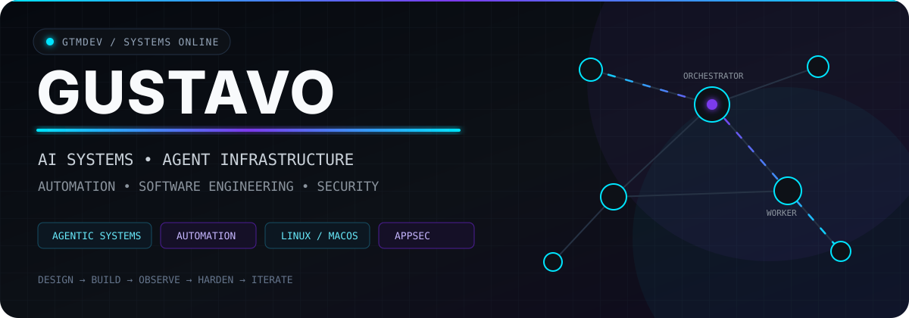
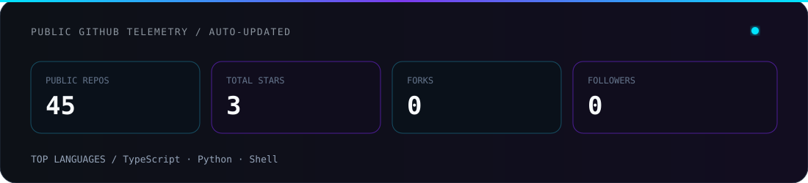

<div align="center">



<br>


<br>


</div>

---

## `> SYSTEM_PROFILE`

I design and build systems where **AI agents, software, infrastructure and automation operate as one stack**.

```text
MODEL → AGENT → TOOLING → INFRASTRUCTURE → SOFTWARE → FEEDBACK
```

My work is centered on autonomous workflows, agent orchestration, developer tooling, operational automation, Linux systems and responsible security research.

The goal is simple: **make complex systems useful, observable and reliable**.

---

## `> OPERATING_MODEL`

```text
                     ┌────────────────────────────┐
                     │       macOS CONTROL        │
                     │  OpenCode · Codeman · Git  │
                     └──────────────┬─────────────┘
                                    │
                              SSH / tmux
                                    │
                     ┌──────────────▼─────────────┐
                     │       Ubuntu WORKER        │
                     │   OpenCode · Git · Shell   │
                     └──────────────┬─────────────┘
                                    │
                           build / test / report
```

I care about boundaries between **orchestration, execution, state and observability**, not just whether an agent can produce a clever response once.

---

## `> ENGINEERING_DOMAINS`

```yaml
ai_systems:
  - autonomous-agents
  - multi-agent-orchestration
  - context-routing
  - llm-tooling

automation:
  - business-processes
  - developer-workflows
  - system-integration
  - remote-execution

software:
  - python
  - typescript
  - nextjs
  - fastapi
  - linux

security:
  - web-security
  - api-security
  - authentication
  - business-logic
  - responsible-disclosure
```

---

## `> SELECTED_WORK`

<table>
<tr>
<td width="50%" valign="top">

### [`agent-ci`](https://github.com/gtmdev-br/agent-ci)

CI/CD for agent configurations: validate, test and benchmark OpenCode profiles.

`TypeScript` `Agents` `CI/CD`

</td>
<td width="50%" valign="top">

### [`opencode-profiles`](https://github.com/gtmdev-br/opencode-profiles)

Switch between specialized OpenCode agent personalities, MCP configurations and permission sets.

`Shell` `OpenCode` `Agent Config`

</td>
</tr>

<tr>
<td width="50%" valign="top">

### [`agencia-agents`](https://github.com/gtmdev-br/agencia-agents)

Agent-oriented automation experiments for operational workflows.

`Agents` `Automation` `Orchestration`

</td>
<td width="50%" valign="top">

### [`aigen-protocol`](https://github.com/gtmdev-br/aigen-protocol)

Exploratory infrastructure around agentic systems and interoperable AI workflows.

`AI` `Protocols` `Infrastructure`

</td>
</tr>
</table>

---

## `> STACK`

<div align="center">


<br><br>


</div>

---

## `> SECURITY_RESEARCH`

Security work follows an **authorization-first, scope-first, responsible disclosure** workflow.

```text
SCOPE → RECON → VALIDATE → DOCUMENT → DISCLOSE
```

`Web Security` · `API Security` · `Authentication` · `Business Logic` · `Bug Bounty`

No mystery theatrics. Clear scope, reproducible evidence, useful reports.

---

## `> GITHUB_TELEMETRY`

<div align="center">



<br><br>


</div>

> `metrics.svg` is generated from GitHub's public API and refreshed automatically by GitHub Actions.

---

## `> ENGINEERING_PRINCIPLES`

```python
while system.has_bottleneck():
    observe()
    reduce_ambiguity()
    simplify()
    automate()
    test()
    measure()
    iterate()
```

- Prefer **systems over demos**
- Prefer **observable behavior over cleverness**
- Prefer **clear interfaces over hidden coupling**
- Prefer **reproducible results over impressive screenshots**
- Automate only after understanding the process being automated

---

<div align="center">

### `DESIGN → BUILD → OBSERVE → HARDEN → ITERATE`

<sub>AI systems · agent infrastructure · automation · software engineering · responsible security research</sub>

</div>
